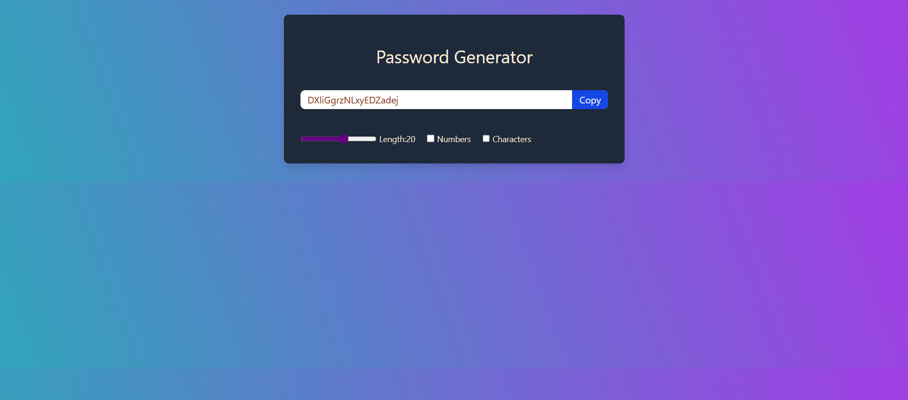

# 🔐 React Password Generator

A simple and customizable password generator built with **React** and **Tailwind CSS**. It lets users generate secure passwords of desired length with optional inclusion of numbers and special characters. Passwords can be easily copied to the clipboard with a single click.

---

## Preview

## 🚀 Features

- ✅ Generate random secure passwords
- 🎚️ Adjustable password length (6 to 30)
- 🔢 Option to include numbers
- 🔠 Option to include special characters
- 📋 Copy to clipboard functionality
- 🌐 Responsive design

---

## 🛠️ Tech Stack

- **React**
- **Tailwind CSS**
- **Vite** (for lightning-fast development server)

---

## 🧑‍💻 Getting Started

### 1. Clone the Repository

bash
git clone https://github.com/your-username/password-generator.git
cd password-generator

## 2. Install Dependencies
npm install

## 3. Run the Development Server
npm run dev
